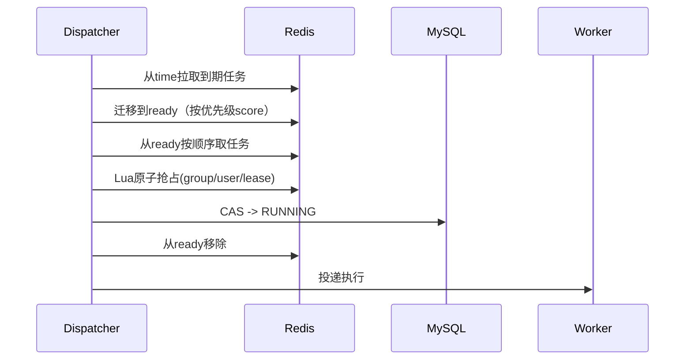

# user-task-scheduler

轻量级 Spring Boot Starter 调度器，支持：

- 多任务组（group）
- group 最大并发
- user 并发（支持动态扩缩容）
- 优先级调度（高优先级先执行）
- DB 状态机 + Redis 调度加速
- 宕机恢复（心跳超时自动回收重试）
- 可选业务状态查询接口（业务已完成/失败则不重复执行）
- `ext_info` 跨重试传递（支持保存中间结果、实现多阶段任务）

## 1. 核心设计

- DB 是最终真相：任务状态、执行记录都在 MySQL
- Redis 是协作层：time/ready 双队列 + 并发计数 + lease
- 调度两阶段：先 `time`，后 `ready`
- 至少一次语义：调度内部唯一键是 `task_no`，业务幂等由业务侧自行保证

## 2. 两阶段调度（保障吞吐 + 优先级）

1. `sched:queue:time:{group}`：控制任务到期（`execute_at`）
2. `sched:queue:ready:{group}`：只放已到期任务，按优先级排序

ready score：

`score = (MAX_PRIORITY - priority) * 10^13 + createTimeEpochMillis`

保证：

- 同 group 下，已到期且未执行任务中，高优先级先执行
- 同优先级按提交先后执行



## 3. 宕机恢复

- Worker 执行中持续更新 DB `heartbeat_time`
- 同时续期 Redis lease（`sched:task:lease:{taskId}`）
- Recovery 扫描 `RUNNING` 且心跳超时任务：
    - 若 lease 不存在/不匹配：回收任务
    - 可重试：`WAIT_RETRY` 并回 `time` 队列
    - 不可重试：`FAILED`

## 4. 接入方式

### 4.1 Maven 依赖

```xml
<dependency>
  <groupId>org.dong</groupId>
  <artifactId>scheduler-starter</artifactId>
  <version>1.0-SNAPSHOT</version>
</dependency>
```

### 4.2 建表

执行：

- [schema-mysql.sql](/Users/chenmingdong01/Documents/github/user-task-scheduler/scheduler-starter/src/main/resources/sql/schema-mysql.sql)

### 4.3 基础配置

```yaml
scheduler:
  enabled: true
  auto-init-default-group: true
  default-group-code: public-group
  default-group-max-concurrency: 100
  default-group-user-base-concurrency: 4
  default-group-dispatch-batch-size: 100
  default-group-heartbeat-timeout-sec: 90
  default-group-lock-expire-sec: 120
  dispatch-interval-ms: 500
  recovery-interval-ms: 30000
  queue-refill-interval-ms: 15000
  worker-threads: 16
  heartbeat-interval-sec: 10
  default-retry-delay-sec: 15
  default-execute-timeout-sec: 600
  # instance-id: your-instance-id
```

`group` 配置来自 DB 表 `scheduler_group_config`。当 `auto-init-default-group=true` 时，框架会在启动时幂等插入默认公共 group（只在不存在时插入，不覆盖已有配置）。

字段说明：

- `enabled`：是否启用调度器（`false` 时不执行 dispatch/recover/refill）。推荐默认：`true`
- `auto-init-default-group`：启动时自动确保默认公共 group 存在。推荐默认：`true`
- `default-group-code`：默认公共 group 编码；提交任务未传 `groupCode` 时会使用该值。推荐默认：`public-group`
- `default-group-max-concurrency`：默认公共 group 的全局最大并发。推荐默认：`100`
- `default-group-user-base-concurrency`：默认公共 group 的单用户基础并发。推荐默认：`4`
- `default-group-dispatch-batch-size`：默认公共 group 的每轮调度批大小。推荐默认：`100`
- `default-group-heartbeat-timeout-sec`：默认公共 group 心跳超时阈值。推荐默认：`90`
- `default-group-lock-expire-sec`：默认公共 group 任务租约过期时间。推荐默认：`120`
- `dispatch-interval-ms`：调度周期（毫秒），越小调度越及时，但 Redis/DB 压力更高。推荐默认：`500`
- `recovery-interval-ms`：恢复任务周期（毫秒），用于回收心跳超时任务。推荐默认：`30000`
- `queue-refill-interval-ms`：队列补偿周期（毫秒），把 DB 中可运行任务补回 Redis 队列。推荐默认：`15000`
- `worker-threads`：本实例执行线程池大小（仅影响本实例并发执行能力）。推荐默认：`16`
- `heartbeat-interval-sec`：运行中心跳上报周期（秒）。推荐默认：`10`
- `default-retry-delay-sec`：默认重试延迟（秒），用于失败重试和业务状态延后重检。推荐默认：`15`
- `default-execute-timeout-sec`：任务默认执行超时（秒）。推荐默认：`600`
- `instance-id`：实例标识（可选）；不填时自动生成主机名+UUID。推荐默认：留空自动生成

### 4.4 scheduler_group_config 说明

是的，这张表是**人工配置表**，由运维/管理员按业务容量手工维护（或通过内部配置平台维护），不是程序自动生成策略。

核心字段说明：

- `group_code`：任务组编码（与提交任务中的 `groupCode` 对应）
- `enabled`：是否启用该 group（`1` 启用，`0` 停止调度）
- `max_concurrency`：该 group 全局最大并发
- `user_base_concurrency`：该 group 下单用户基础并发
- `dynamic_user_limit_enabled`：是否开启动态用户并发策略
- `load_strategy_json`：动态并发策略 JSON（见第 6 节）
- `dispatch_batch_size`：每轮调度扫描批大小（影响吞吐与 DB/Redis 压力）
- `heartbeat_timeout_sec`：任务心跳超时阈值（超过后进入恢复流程）
- `lock_expire_sec`：任务 lease 过期时间（Redis 侧执行租约）
- `description`：备注信息

使用建议：

- 新增业务线时，先创建对应 `group_code` 配置再放量
- `max_concurrency` 和 `user_base_concurrency` 应按资源容量压测后设置
- `heartbeat_timeout_sec` 建议大于心跳周期的 3 倍以上

## 5. 业务接入接口

### 5.1 提交任务

注入 `SchedulerClient`：

```java
@Autowired
private SchedulerClient schedulerClient;

public void submitDemo() {
    TaskSubmitRequest req = new TaskSubmitRequest()
            // groupCode 可选；不传则回退到 scheduler.default-group-code
            .setGroupCode("image-render")
            .setUserId("user-1001")
            .setBizType("image.render")
            .setBizKey("biz-key-001")
            .setPriority(90)
            .setRetryDelaySec(20)
            .setExtInfo("{\"prompt\":\"hello\"}");
    // executeAt 默认当前时间（立即执行）；maxRetryCount 默认 3
    long taskId = schedulerClient.submit(req);
}
```

补充说明：

- `bizKey`：必填，可重复；是否幂等由业务侧控制
- `groupCode`：可选；为空时自动回退到 `scheduler.default-group-code`
- `extInfo`：可选字符串，会透传给 `TaskHandler`；若执行结果返回新的 `extInfo`，调度器会写回 DB，后续重试拿到最新值
- `retryDelaySec`：单任务重试间隔（秒），可选
- 若未设置，则回退到全局配置 `scheduler.default-retry-delay-sec`
- 该参数会影响失败重试、业务状态延后重检、恢复补偿后的下次执行时间

### 5.2 `ext_info` 中间结果传递（多阶段任务）

- 提交任务时可写入初始 `extInfo`（字符串）
- `TaskHandler` 执行后可在 `TaskExecuteResult` 中返回新的 `extInfo`
- 调度器会把新的 `extInfo` 持久化到 `scheduler_task.ext_info`
- 任务进入下一轮重试/执行时，`SchedulerTask.extInfo` 即为上轮最新值

这使得任务可以在多次执行中逐步推进，并保存每一阶段的中间结果。

### 5.3 注册任务执行器（必须）

```java
@Component
public class ImageRenderHandler implements TaskHandler {
    @Override
    public List<String> bizTypes() {
        // 一个处理器可绑定多个 bizType（处理逻辑相同时很有用）
        return List.of("image.render", "image.upscale");
    }

    @Override
    public TaskExecuteResult execute(SchedulerTask task) {
        // 执行业务
        return TaskExecuteResult.success();
    }
}
```

如果只需要一个业务类型，也需要返回单元素列表，例如 `List.of("image.render")`。

`TaskHandler` 实现要求（强烈建议）：

- 必须保证业务幂等（调度语义是 at-least-once）
- 必须尽量响应线程中断（任务超时后会触发 interrupt）
- 外部 IO 调用需要配置超时，避免不可中断阻塞

超时语义补充：

- 普通超时（可中断）会按重试策略处理
- 若判定为 `TASK_TIMEOUT_UNINTERRUPTIBLE`，会继续按重试策略重派（直到达到 `maxRetryCount`）；该场景可能出现“旧执行线程尚未退出 + 新重试已开始”，必须由业务幂等兜底

### 5.4 业务状态查询接口（可选）

如你有业务表状态，希望“已完成/已失败不再重复调度”，实现：

```java
@Component
public class BizStateProvider implements BusinessTaskStateProvider {
    @Override
    public String bizType() {
        return "image.render";
    }

    @Override
    public BusinessTaskState query(SchedulerTask task) {
        // 读取业务表状态
        // 成功 -> SUCCESS
        // 失败 -> FAILED
        // 需要调度执行 -> NEED_RUNNING
        // 业务运行中/无法判断 -> RUNNING 或 UNKNOWN
        return BusinessTaskState.NEED_RUNNING;
    }
}
```

行为：

- 仅当 `task.bizType == provider.bizType()` 时才会调用该 Provider
- 返回 `SUCCESS`：调度器直接把任务置为 `SUCCESS`
- 返回 `FAILED`：调度器直接把任务置为 `FAILED`
- 仅返回 `NEED_RUNNING`：才会进入调度执行
- 返回 `RUNNING/UNKNOWN`：不会执行，会延后重检业务状态

如果不实现该接口，默认仅根据任务执行结果决定 `SUCCESS/FAILED/WAIT_RETRY`。

## 6. 动态 user 并发

每个 group 可配置策略（`scheduler_group_config.load_strategy_json`）：

```json
{
  "enabled": true,
  "rounding": "FLOOR",
  "minLimit": 1,
  "maxLimit": 20,
  "rules": [
    {"loadLt": 0.25, "factor": 4.0},
    {"loadLt": 0.50, "factor": 2.0},
    {"loadLt": 0.75, "factor": 1.0},
    {"loadLt": 1.01, "factor": 0.5}
  ]
}
```

`load = group_running / group_max_concurrency`

`effectiveUserLimit = clamp(round(base * factor), min, max)`

## 7. 当前代码结构

```text
scheduler-starter/src/main/java/org/dong/scheduler/
  autoconfigure/
  config/
  core/
    enums/
    job/
    model/
    redis/
    repo/
    service/
    spi/
```

## 8. 说明

- 当前实现不依赖外部调度平台
- Redis heartbeat 已移除，只保留 DB heartbeat + Redis lease

## 9. Demo 项目

已提供独立接入示例：

- [demo-consumer/README.md](/Users/chenmingdong01/Documents/github/user-task-scheduler/demo-consumer/README.md)

本地验证（使用你提供的 JDK）：

```bash
export JAVA_HOME=/Users/chenmingdong01/Library/Java/JavaVirtualMachines/openjdk-21.0.1/Contents/Home
mvn -DskipTests install
mvn -DskipTests -pl demo-consumer -am compile
```
