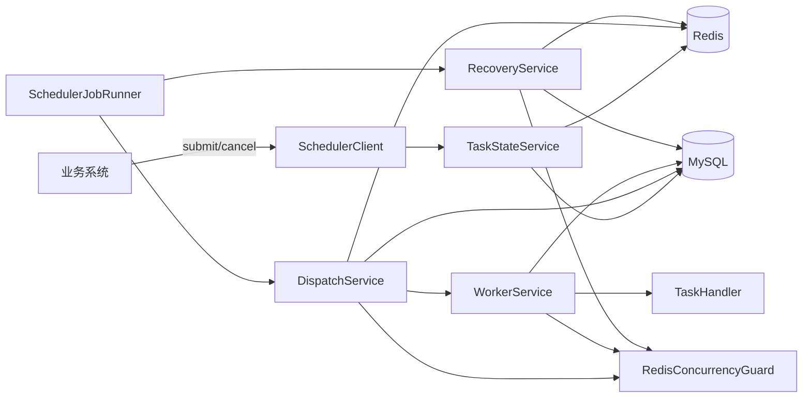
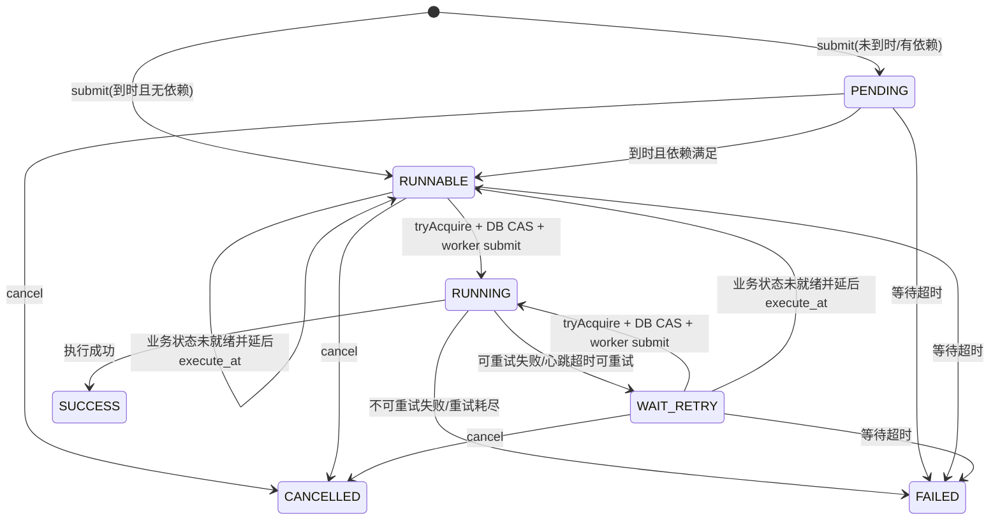

# 调度并发与公平性技术方案

## 1. 目标与范围

本文档描述 `user-task-scheduler` 当前的最终技术方案，重点覆盖：

- 任务状态机与表设计
- 提交、调度、执行、恢复流程
- Redis 队列、并发计数与任务租约
- 用户级公平调度模型
- worker pool 背压与失败补偿
- Redis 丢失后的重建与对账
- 单任务最长等待时间能力

当前方案以 MySQL 为最终真相，以 Redis 作为调度协作层。调度模型已从“单一 ready queue + 深分页扫描”收敛为“三层结构”：

- time queue：管理未来任务
- active user queue：管理当前可调度用户
- per-user ready queue：管理单个用户的可调度任务

系统不新增 `DISPATCHED` 状态，也不在 `scheduler_task` 上增加调度中间态字段。任务执行仍然通过 `tryAcquire -> DB CAS -> worker submit` 主链路完成。

## 2. 设计原则

- DB 是最终真相：任务状态、执行记录、依赖状态以 MySQL 为准。
- Redis 是协作层：承载调度索引、running 计数和 task lease。
- 至少一次语义：恢复、重试、超时都可能带来重复执行，业务必须幂等。
- 高优先级优先，但不追求全局严格优先级绝对排序。
- 公平性以“用户”为调度单位，而不是以“全局任务”为调度单位。
- Redis 任意时刻丢失，都应能基于 MySQL 重建调度索引。
- worker pool 无内部排队：线程池拒绝是背压信号，不让 DB `RUNNING` 长时间脱离真实执行状态。

## 3. 总体架构



核心组件职责：

- `TaskStateService`：提交、取消、终态迁移、依赖下游刷新、路由入队。
- `DispatchService`：time queue 提升、用户选择、批量取任务、并发抢占、DB CAS、worker submit。
- `WorkerService`：执行记录、心跳续租、handler 调用、结果落库、释放并发占用。
- `RecoveryService`：超时 RUNNING 恢复、Redis 队列补齐、running 对账。
- `RedisConcurrencyGuard`：用 Lua 保证 acquire/release 的 lease 与计数操作原子性。
- `QueueRedisService`：维护 time queue、active users、per-user ready queue。

## 4. 数据模型

表定义见 [schema-mysql.sql](../scheduler-starter/src/main/resources/sql/schema-mysql.sql)。

### 4.1 `scheduler_task`

任务主表保存任务当前状态、调度归属、执行生命周期和最近一次错误信息。

关键字段：

- `task_no`：调度内部唯一号
- `group_code`：任务组编码
- `dispatch_route`：路由隔离键
- `user_id`：用户并发控制键
- `biz_type` / `biz_key`：业务类型与业务键
- `status`：`PENDING/RUNNABLE/RUNNING/WAIT_RETRY/SUCCESS/FAILED/CANCELLED`
- `priority`：优先级，范围 `0~99`，数值越小优先级越高
- `execute_at` / `next_retry_at`：计划执行时间 / 下次重试时间
- `retry_count` / `max_retry_count`：当前重试次数 / 最大重试次数
- `execute_timeout_sec` / `retry_delay_sec`：单任务执行超时 / 重试间隔
- `max_wait_sec` / `wait_deadline_at`：单任务最长等待时间 / 等待超时截止时间
- `dispatcher_instance` / `worker_instance` / `worker_thread`：当前执行归属
- `heartbeat_time` / `start_time` / `finish_time`：执行生命周期时间
- `error_code` / `error_msg`：最近一次错误
- `ext_info`：跨重试透传扩展信息
- `version`：乐观锁版本号

关键索引：

- `idx_group_route_status_time(group_code, dispatch_route, status, execute_at)`
- `idx_route_status_time(dispatch_route, status, execute_at)`
- `idx_status_time(status, execute_at)`
- `idx_status_wait_deadline(status, wait_deadline_at)`
- `idx_user_group_status(user_id, group_code, status)`
- `idx_heartbeat(status, heartbeat_time)`

### 4.2 `scheduler_task_execution`

执行明细表保存每次执行尝试。

关键字段：

- `execute_no`：一次执行一次号，唯一索引，同时也是 Redis task lease 值
- `task_id` / `task_no` / `group_code` / `user_id`
- `status`：`RUNNING/SUCCESS/FAILED/WAIT_RETRY`
- `dispatcher_instance` / `worker_instance`
- `start_time` / `finish_time` / `duration_ms`
- `error_code` / `error_msg`

### 4.3 `scheduler_task_dependency`

依赖关系表保存上下游任务关系。

关键字段：

- `task_id`
- `depends_on_task_id`
- `target_state`：`SUCCESS/FAILED/TERMINAL`
- `status`：`WAITING/SATISFIED/IMPOSSIBLE`

### 4.4 `scheduler_group_config`

组配置表保存 group 级并发和调度参数。

关键字段：

- `group_code`
- `enabled`
- `max_concurrency`
- `user_base_concurrency`
- `dynamic_user_limit_enabled`
- `load_strategy_json`
- `dispatch_batch_size`
- `heartbeat_timeout_sec`
- `lock_expire_sec`

当前默认值建议：

- `dispatch_batch_size = 20`
- `activeUserLockTtlMs = 5000`

## 5. 任务状态机



约束：

- `RUNNABLE/WAIT_RETRY -> RUNNING` 必须先成功抢占 Redis 并发，再执行 DB CAS。
- `RUNNING` 只表示任务已真实占用并发额度，并已交给 worker 执行。
- 等待超时只作用于 `PENDING/RUNNABLE/WAIT_RETRY`，不能误杀已进入 `RUNNING` 的任务。

## 6. Redis 设计

### 6.1 Key 设计

#### 1. 时间队列

- `sched:queue:time:{group}:{route}`
- 类型：`ZSET`
- member：`taskId`
- score：`executeAtEpochMillis`

用途：

- 保存未来任务
- 到期后 promote 到用户 ready queue

#### 2. 活跃用户队列

- `sched:active-users:{group}:{route}`
- 类型：`ZSET`
- member：`userId`
- score：`activeScore = headPriority * 10^13 + fairScore`

其中：

- `headPriority`：该用户 ready 队列当前队首任务优先级
- `fairScore`：相对时间毫秒值，用于同优先级下轮转公平

用途：

- 先选“当前拥有更高优先级任务”的 user
- 同优先级 user 间按轮转顺序公平调度

#### 3. 用户 ready 队列

- `sched:ready:user:{group}:{route}:{userId}`
- 类型：`ZSET`
- member：`taskId`
- score：`taskScore = priority * 10^13 + createTimeMillis`

用途：

- 一个 user 一个 ready queue
- 同用户内先按优先级，再按创建时间排序

#### 4. 活跃用户锁

- `sched:active-user-lock:{group}:{route}:{userId}`
- 类型：`STRING`
- 值：随机 token
- 获取方式：`SET key token NX PX 5000`

用途：

- 避免多个实例同时处理同一个 user 的一轮 dispatch
- 这是性能锁，不是最终正确性的唯一保障

#### 5. 并发与租约 Key

- `sched:group:running:{group}`
- `sched:user:running:{group}:{user}`
- `sched:task:lease:{taskId}`

### 6.2 Redis 正确性语义

- `active-user-lock` 过期或实例重启，不会直接导致重复执行。
- 真正兜底的是：
  - `tryAcquire(...)`
  - `taskRepository.casToRunning(...)`
  - `reconcileRunningCounters...(...)`
- Redis 可以丢，但丢后必须能基于 MySQL 重建。

## 7. 核心配置

```yaml
utask:
  scheduler:
    dispatch-interval-ms: 500
    recovery-interval-ms: 30000
    queue-refill-interval-ms: 15000
    worker-threads: 16
    max-worker-threads: 200
    heartbeat-interval-sec: 10
    default-execute-timeout-sec: 600
    default-retry-delay-sec: 15
    active-user-lock-ttl-ms: 5000
    default-group-dispatch-batch-size: 20
    timeout-monitor-threads: 2
    reconcile-lock-sec: 30
    immediate-reconcile-throttle-sec: 3
```

关键说明：

- `dispatch_batch_size` 建议生产默认 `20`
- worker pool `queueCapacity = 0`
- `activeUserLockTtlMs` 默认 `5000`
- `priorityBaseEpoch` 默认 `2026-01-01 00:00:00`

## 8. 提交流程

入口：`DefaultSchedulerClient.submit` / `TaskStateService.submit`

1. 归一化提交参数：
   - 默认 group
   - 默认 `executeAt`
   - 默认 `maxRetryCount`
   - `priority` 截断到 `0~99`
   - `maxWaitSec > 0` 时计算 `waitDeadlineAt`
2. 事务内插入 `scheduler_task`
3. 如果请求包含依赖，写入 `scheduler_task_dependency`
4. 计算初始状态：
   - 无依赖且到期：`RUNNABLE`
   - 否则：`PENDING`
5. 事务提交后路由入队：
   - `executeAt > now`：进入 `timeQueue`
   - `RUNNABLE && executeAt <= now`：进入 `user ready queue` 并刷新 `active-users`

## 9. 调度流程

入口：`SchedulerJobRunner.dispatch` -> `DispatchService.dispatchOnce`

### 9.1 group 级调度

1. 获取启用的 group 列表
2. 对每个 group：
   - 先从 time queue 提升到期任务
   - 校验 DB 状态，必要时把 `PENDING` 提升为 `RUNNABLE`
   - 将可执行任务写入对应 `user ready queue`
   - 当 `groupRunning < groupMaxConcurrency` 时循环选 user 调度

### 9.2 用户选择与一轮派发

1. 从 `active-users` 取 score 最小的 user
2. 尝试获取 `active-user-lock`
3. 成功后读取该 user 当前队首优先级 `P`
4. 只读取该 user、该优先级下的一页任务：
   - `pageSize = min(groupRemaining, userRemaining, dispatchBatchSize)`
5. 对这一页逐个任务执行：
   - 校验 DB 状态 / 到期时间 / wait deadline
   - 业务状态短路检查
   - `tryAcquire`
   - `casToRunning`
   - `workerService.submit`
6. 本轮结束后：
   - 如果队列空，移出 `active-users`
   - 如果队列未空，重新计算 `activeScore`，将该 user 放回尾部

### 9.3 公平性语义

当前公平性是：

- 先按 user 当前最高优先级排序
- 同优先级 user 之间按轮转顺序公平
- 单个 user 一轮只消费自己当前最高优先级的一页任务

当前不追求：

- 全局所有任务严格优先级绝对排序

这是性能与公平的折中。

### 9.4 dispatchBatchSize 的语义

- `dispatchBatchSize` 决定单个 user 一轮最多取多少个同优先级任务
- 值越大，吞吐越高，但单机更容易连续吃掉同一 user 的一批任务
- 值越小，公平性更好，但 Redis/DB 交互更频繁

当前默认值定为 `20`，作为吞吐与公平的折中值。

## 10. 并发控制与正确性

### 10.1 Redis 原子抢占

`RedisConcurrencyGuard.tryAcquire` 通过 Lua 保证以下操作原子执行：

1. 校验 group running 未超过上限
2. 校验 user running 未超过动态上限
3. 写入 `task lease = executeNo`
4. 递增 group running
5. 递增 user running

### 10.2 DB CAS

Redis 抢占成功后，必须继续执行：

- `RUNNABLE/WAIT_RETRY -> RUNNING` 的 DB CAS

只有 CAS 成功，任务才真正进入执行态。

### 10.3 锁过期 / 机器重启的影响

- `active-user-lock` 持有期间机器重启，只会让该 user 短暂停调到 TTL 过期
- 若已经走到 `tryAcquire` 或 `RUNNING`：
  - 可能短暂出现并发额度假占用
  - 或任务停留在 `RUNNING`
  - 最终由 `reconcile + recover` 修正

## 11. 动态用户并发

组件：`DynamicUserLimitService`

输入：

- `groupRunning`
- `groupMaxConcurrency`
- `userBaseConcurrency`
- `load_strategy_json`

计算逻辑：

```text
load = groupRunning / groupMaxConcurrency
factor = 第一条满足 load < rule.loadLt 的规则 factor
effectiveUserLimit = clamp(rounding(userBaseConcurrency * factor), minLimit, maxLimit)
```

效果：

- 低负载时放宽单用户并发
- 高负载时收敛单用户并发
- 避免 heavy user 长时间吃满 group 容量

## 12. Worker 执行流程

入口：`WorkerService.submit` / `WorkerService.run`

1. 写入 `scheduler_task_execution` 一条 `RUNNING` 明细
2. 启动 heartbeat，续租 task lease
3. 执行业务状态短路检查
4. 用 `executeWithTimeout` 调用 `TaskHandler.execute`
5. 根据结果迁移任务状态：
   - 成功：`SUCCESS`
   - 可重试失败：`WAIT_RETRY`
   - 不可重试失败：`FAILED`
6. finally 中：
   - 取消 heartbeat
   - 按 `executeNo` 释放 Redis 占用
   - 更新执行明细最终状态
7. 如果 release mismatch，不盲目扣减 running，触发即时 reconcile

## 13. 最长等待时间方案

### 13.1 语义

- `maxWaitSec` 为可选字段
- `null` 表示不限时
- `<= 0` 在提交阶段直接拒绝
- 超时计时从任务提交成功开始计算
- 判断边界是“进入 RUNNING 前”
- 一旦进入 `RUNNING`，后续不再受该约束

### 13.2 持久化设计

字段：

- `max_wait_sec`
- `wait_deadline_at`

索引：

- `idx_status_wait_deadline(status, wait_deadline_at)`

设计理由：

- 提交时预计算 deadline
- 超时扫描能走稳定范围索引

### 13.3 处理链路

1. 提交时计算 `waitDeadlineAt`
2. 定时任务扫描 `PENDING/RUNNABLE/WAIT_RETRY` 中已超时任务
3. 调度热路径在 CAS `RUNNING` 前再次兜底判断
4. refill / rebuild 时遇到已超时任务，优先置 `FAILED`
5. 超时失败走现有终态传播逻辑，继续驱动依赖任务

错误码：

- `SCHEDULE_WAIT_TIMEOUT`

## 14. Recovery、Refill 与 Reconcile

### 14.1 heartbeat timeout recovery

入口：`RecoveryService.recoverTimeoutRunning`

逻辑：

- 扫描 DB 中 heartbeat 超时的 `RUNNING` 任务
- lease 仍存在则跳过
- lease 不存在且可重试：
  - 转 `WAIT_RETRY`
  - repair release
  - 重新入队
- lease 不存在且不可重试：
  - 转 `FAILED`
  - repair release

### 14.2 queue refill

入口：`RecoveryService.refillQueue`

逻辑：

1. 提升到期且依赖满足的 `PENDING`
2. 查询 `RUNNABLE/WAIT_RETRY`
3. 查询未来 `PENDING`
4. 对 `execute_at > now` 的任务补入 `timeQueue`
5. 对 `execute_at <= now` 的任务补入 `user ready queue`
6. 刷新 `active-users`

当前实现已经支持：

- Redis 全清后补 time queue
- Redis 全清后补 ready queue
- 未来任务恢复

### 14.3 running counter reconcile

入口：

- `reconcileRunningCountersIfNeeded`
- `reconcileRunningCountersImmediately`

逻辑：

- `redis < db`：按 DB 重建
- `redis == db`：跳过
- `redis > db`：按 DB 用户集合修剪，再兜底扫描 Redis 用户 running

用途：

- Redis key 丢失后重建并发计数
- release mismatch 后修正假占用

## 15. Redis 清空后的恢复能力

系统要求 Redis 任意时刻被全量清空后，仍能继续执行线上任务。

恢复依赖：

1. DB 仍保留任务真相
2. `refillQueue` 能补：
   - `timeQueue`
   - `user ready queue`
   - `active-users`
3. `reconcile` 能补：
   - group running
   - user running
4. `recoverTimeoutRunning` 能把失联 `RUNNING` 任务拉回 `WAIT_RETRY/FAILED`

因此 Redis 丢失不会直接丢任务，只会带来一段恢复窗口。

## 16. 上线与迁移策略

建议迁移原则：

- 不做长期双读调度
- 以 MySQL 为真相源补齐新索引
- 先补齐，再切流

迁移步骤：

1. 上线支持 `active-users + user ready queue` 的代码
2. 保持旧任务仍可通过 MySQL 补齐进入新索引
3. 运行重建作业，把线上存量任务补入新结构
4. 灰度切到 user 级公平调度
5. 验证后全量切换

## 17. 失败补偿规则

| 场景 | DB 处理 | Redis 处理 | 队列处理 |
|------|---------|------------|----------|
| `tryAcquire` 失败 | 不改 DB | 不改 Redis | 当前任务跳过 |
| DB CAS 失败 | 不改 DB | 按 `executeNo` release | 任务留待后续重扫 |
| worker submit 失败 | 回滚为 `RUNNABLE` | 按 `executeNo` release | 从 ready 删掉，重新入 time queue |
| 业务状态已成功/失败 | 直接终态化 | 不占用 running | 从 ready 删除 |
| 业务状态未就绪 | 延后 `execute_at` | 不占用 running | 重新入 time queue |
| handler 成功 | `SUCCESS` | release | 不入队 |
| handler 可重试失败 | `WAIT_RETRY` | release | 入 time queue |
| handler 不可重试失败 | `FAILED` | release | 不入队 |
| heartbeat 超时 | `WAIT_RETRY/FAILED` | repair release | 可重试任务重新入队 |
| wait timeout | `FAILED` | 不抢占或释放 | 不再调度 |

## 18. 风险与约束

1. 公平性是用户级公平，不是全局任务级严格公平。
2. `dispatchBatchSize` 过大，会降低公平性并增加单机局部集中。
3. `dispatchBatchSize` 过小，会增加 Redis/DB 交互次数。
4. `active-user-lock` 过短，会增加多实例竞争和空转。
5. handler 超时依赖 interrupt 协作，不能强杀不响应中断的业务代码。
6. 至少一次语义要求业务侧按 `biz_key` 或业务唯一键幂等。

## 19. 监控建议

- worker pool active/max threads
- `DISPATCH_SUBMIT_REJECTED` 数量
- Redis group/user running topN
- DB `RUNNING` by group/user
- Redis running 与 DB `RUNNING` 差值
- heartbeat timeout recovery 数量
- release mismatch 次数
- refill 恢复数量
- wait timeout 数量
- 单 user 一轮 dispatch 耗时

## 20. 代码定位

- [SchedulerAutoConfiguration.java](../scheduler-starter/src/main/java/org/dong/scheduler/autoconfigure/SchedulerAutoConfiguration.java)
- [DispatchService.java](../scheduler-starter/src/main/java/org/dong/scheduler/core/service/DispatchService.java)
- [WorkerService.java](../scheduler-starter/src/main/java/org/dong/scheduler/core/service/WorkerService.java)
- [RecoveryService.java](../scheduler-starter/src/main/java/org/dong/scheduler/core/service/RecoveryService.java)
- [TaskStateService.java](../scheduler-starter/src/main/java/org/dong/scheduler/core/service/TaskStateService.java)
- [DynamicUserLimitService.java](../scheduler-starter/src/main/java/org/dong/scheduler/core/service/DynamicUserLimitService.java)
- [RedisConcurrencyGuard.java](../scheduler-starter/src/main/java/org/dong/scheduler/core/redis/RedisConcurrencyGuard.java)
- [QueueRedisService.java](../scheduler-starter/src/main/java/org/dong/scheduler/core/redis/QueueRedisService.java)
- [JdbcTaskRepository.java](../scheduler-starter/src/main/java/org/dong/scheduler/core/repo/JdbcTaskRepository.java)
- [schema-mysql.sql](../scheduler-starter/src/main/resources/sql/schema-mysql.sql)

## 21. 结论

当前方案的核心是：

- 用 MySQL 保存任务真相
- 用 Redis 维护 `time queue + active users + per-user ready queue`
- 用 `tryAcquire + DB CAS + worker submit` 保证执行正确性
- 用 `refill + recover + reconcile` 保证异常可恢复

它相对旧的深分页方案，优势在于：

- 不再依赖 Redis / MySQL 深分页
- 同时兼顾优先级与用户级公平
- Redis 丢失后可完整恢复
- 与现有执行链路兼容，迁移成本可控
