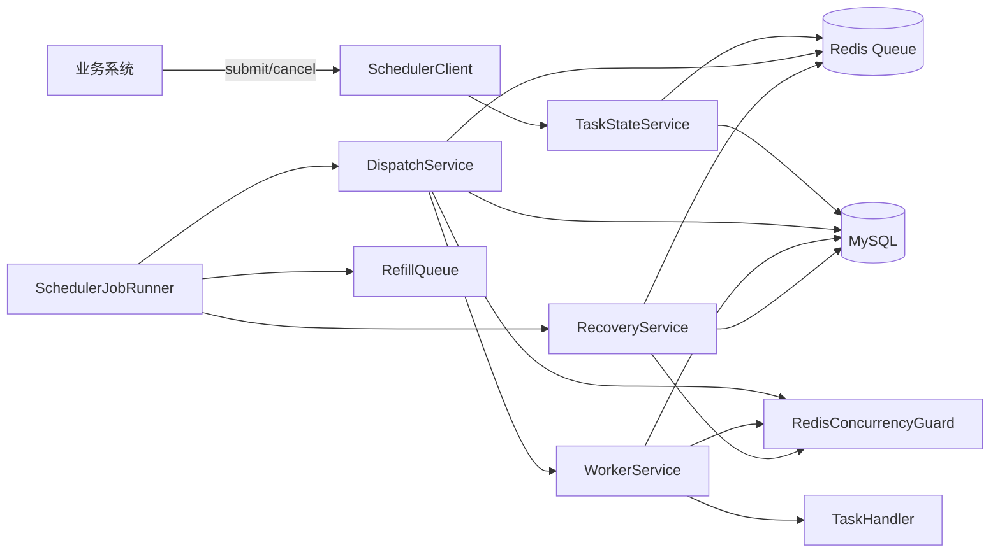
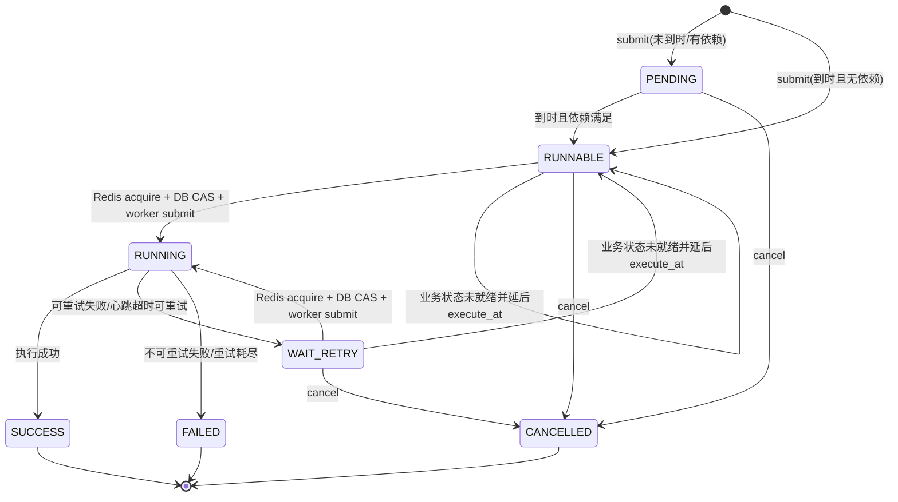
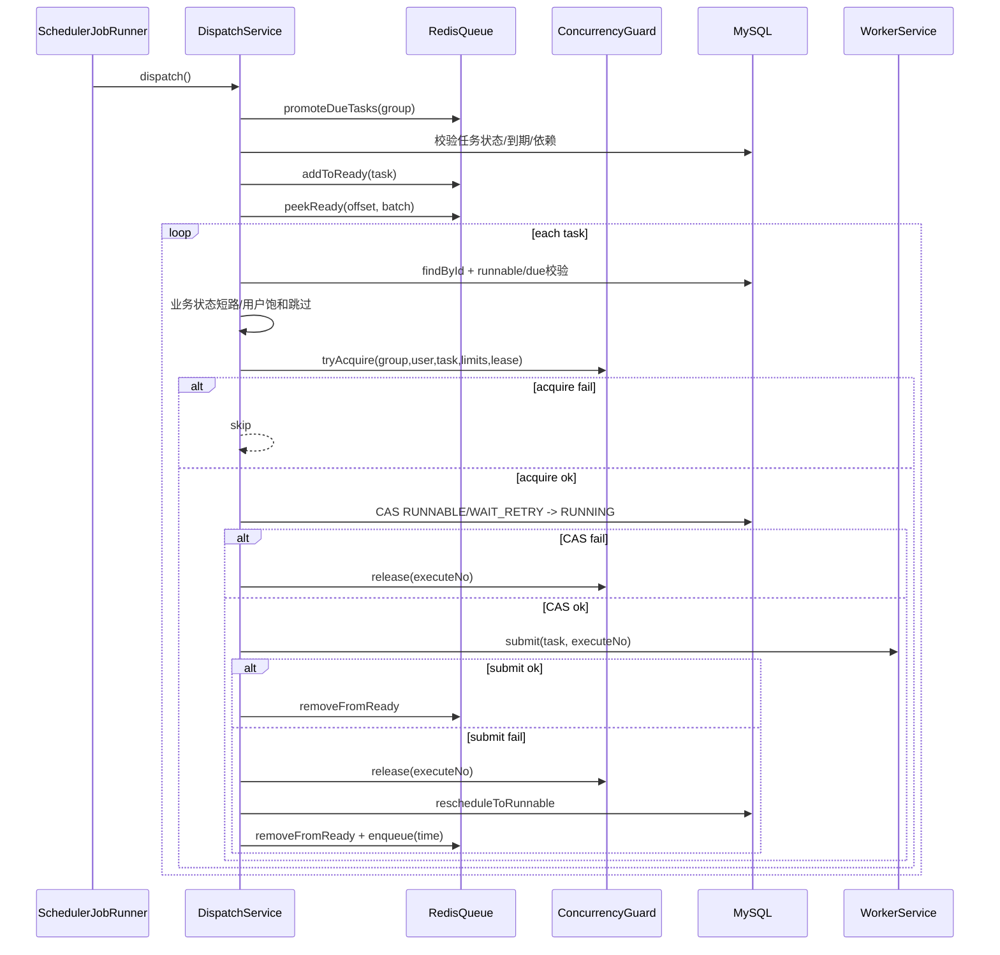
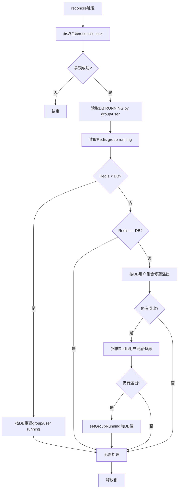

# 调度并发与公平性技术方案

## 1. 目标与范围

本文档描述 `user-task-scheduler` 当前调度并发、公平性与一致性实现方案，重点覆盖：

- 表设计与状态机
- 提交、调度、执行、恢复流程
- Redis 队列、并发计数与任务租约
- 动态用户并发策略
- worker pool 背压与失败补偿
- running 计数对账策略

当前方案不新增 `DISPATCHED` 状态，也不在 `scheduler_task` 上增加 `dispatch_*` 调度阶段字段。系统通过 Redis time/ready queue、Redis running 计数、DB 状态机和一个全局无等待队列 worker pool 完成调度。worker pool 的队列容量固定为 `0`，提交成功基本等价于任务已经获得执行线程；提交失败作为系统背压信号，由调度侧回滚 DB/Redis 占用并延后重试。

## 2. 设计原则

- DB 是最终真相：任务状态、执行记录和依赖状态以 MySQL 为准。
- Redis 是协作层：承载 time/ready queue、group/user running 计数和 task lease。
- 至少一次语义：异常恢复、超时重试和不可中断超时都可能导致重复执行，业务侧必须幂等。
- 无外部调度平台依赖：运行时仅依赖 MySQL + Redis。
- 无长期 worker 排队：DB `RUNNING` 只表示任务已抢占并提交到无等待队列 worker pool。
- 可补偿链路：Redis acquire、DB CAS、worker submit 任一步失败，都必须按本轮 `executeNo` 安全释放或回滚。

## 3. 总体架构



核心组件职责：

- `TaskStateService`：提交、取消、终态迁移和依赖下游刷新。
- `DispatchService`：time queue 提升、ready queue 扫描、并发抢占、DB CAS 和 worker submit。
- `WorkerService`：执行记录、心跳续租、handler 调用、结果落库和释放并发占用。
- `RecoveryService`：超时 RUNNING 恢复、队列 refill、running 计数 reconcile。
- `RedisConcurrencyGuard`：用 Lua 脚本保证 acquire/release 的 lease 与计数操作原子性。
- `QueueRedisService`：维护 time queue 与 ready queue。

## 4. 数据模型

表定义见 [schema-mysql.sql](../scheduler-starter/src/main/resources/sql/schema-mysql.sql)。

### 4.1 `scheduler_task` 任务主表

任务主表保存任务当前状态、调度归属、执行生命周期和最近一次错误信息。

关键字段：

- `task_no`：调度内部唯一号，唯一索引。
- `group_code`：任务组编码，也是 group 并发控制维度。
- `user_id`：用户维度并发键。
- `biz_type`：业务类型，用于匹配 `TaskHandler` 和可选业务状态查询器。
- `biz_key`：业务键，可重复，用于业务侧关联和幂等。
- `status`：`PENDING/RUNNABLE/RUNNING/WAIT_RETRY/SUCCESS/FAILED/CANCELLED`。
- `priority`：优先级，值越大优先级越高。
- `execute_at` / `next_retry_at`：计划执行时间与下次重试时间。
- `retry_count` / `max_retry_count`：当前重试次数与最大重试次数。
- `execute_timeout_sec` / `retry_delay_sec`：单任务执行超时和重试间隔配置。
- `dispatcher_instance` / `worker_instance` / `worker_thread`：当前执行归属。
- `heartbeat_time` / `start_time` / `finish_time`：当前任务执行生命周期时间。
- `error_code` / `error_msg`：任务最近一次错误。
- `ext_info`：跨重试透传的扩展信息。
- `version`：乐观锁版本号。

关键索引：

- `idx_group_status_time(group_code, status, execute_at)`
- `idx_status_time(status, execute_at)`
- `idx_user_group_status(user_id, group_code, status)`
- `idx_heartbeat(status, heartbeat_time)`
- `idx_biz_type_biz_key(biz_type, biz_key)`

不需要新增 `dispatch_time`、`dispatch_execute_no`、`dispatch_error_code`、`dispatch_error_msg`。调度抢占时间可由 `start_time` 表达，执行号和每次执行错误落在执行明细表。

### 4.2 `scheduler_task_execution` 执行明细表

执行明细表保存每次执行尝试，支持按任务追踪执行历史。

关键字段：

- `execute_no`：一次执行一次号，唯一索引，也是 Redis task lease 的值。
- `task_id` / `task_no` / `group_code` / `user_id`：执行归属信息。
- `status`：本次执行状态，取值包括 `RUNNING/SUCCESS/FAILED/WAIT_RETRY`。
- `dispatcher_instance` / `worker_instance`：本次执行实例。
- `start_time` / `finish_time` / `duration_ms`：本次执行耗时。
- `error_code` / `error_msg`：本次执行错误。

### 4.3 `scheduler_task_dependency` 依赖关系表

关键字段：

- `task_id`：当前任务 ID。
- `depends_on_task_id`：依赖的上游任务 ID。
- `target_state`：期望上游状态，支持 `SUCCESS/FAILED/TERMINAL`。
- `status`：依赖状态，支持 `WAITING/SATISFIED/IMPOSSIBLE`。

约束：

- `uk_task_dependency(task_id, depends_on_task_id)`：避免重复依赖。
- `idx_depends_on_status(depends_on_task_id, status)`：支持上游终态后刷新下游。
- `idx_task_status(task_id, status)`：支持判断当前任务依赖是否全部满足。

### 4.4 `scheduler_group_config` 组配置表

关键字段：

- `group_code`：唯一组编码。
- `enabled`：组开关。
- `max_concurrency`：group 最大并发。
- `user_base_concurrency`：用户基础并发。
- `dynamic_user_limit_enabled`：动态用户并发开关。
- `load_strategy_json`：动态并发策略 JSON。
- `dispatch_batch_size`：每轮 ready/time queue 扫描批大小。
- `heartbeat_timeout_sec`：心跳超时阈值。
- `lock_expire_sec`：task lease TTL。

## 5. 任务状态机



迁移约束：

- `RUNNABLE/WAIT_RETRY -> RUNNING` 必须先成功抢占 Redis 并发，再 CAS 更新 DB。
- 终态迁移统一经 `TaskStateService`，同步触发依赖下游刷新。
- Redis 队列命中不代表一定可执行，最终以 DB 状态和 `execute_at` 校验为准。
- `RUNNING` 不表达“调度中间态”，只表达当前任务已占用 group/user 并发额度，并已交给 worker 执行生命周期管理。

## 6. Redis 队列与并发 Key

### 6.1 队列

- time queue：按 `execute_at` 存放未到期任务，到期后提升到 ready queue。
- ready queue：按优先级和创建时间存放可调度任务。

ready queue score：

```text
score = (MAX_PRIORITY - priority) * 10^13 + createTimeEpochMillis
```

该排序保证高优先级任务优先，同优先级按创建时间先后执行。

### 6.2 并发与租约 Key

- `sched:group:running:{group}`：group 当前并发占用数。
- `sched:user:running:{group}:{user}`：group 内用户当前并发占用数。
- `sched:task:lease:{taskId}`：任务本轮执行 lease，值为 `executeNo`。

Redis running 不是 DB `RUNNING` 的强事务镜像，而是调度准入的并发令牌。正常情况下它应与 DB `RUNNING` 接近一致；异常场景依赖 reconcile 按 DB 修复。

## 7. 核心配置

```yaml
utask:
  scheduler:
    dispatch-interval-ms: 500
    recovery-interval-ms: 30000
    queue-refill-interval-ms: 15000
    worker-threads: 16
    max-worker-threads: 1000
    heartbeat-interval-sec: 10
    default-execute-timeout-sec: 600
    timeout-monitor-threads: 2
    reconcile-lock-sec: 30
    immediate-reconcile-throttle-sec: 3
```

- `worker-threads`：worker pool 核心线程数。
- `max-worker-threads`：worker pool 最大线程数，实际取 `max(workerThreads, maxWorkerThreads)`。
- worker pool `queueCapacity` 固定为 `0`，不暴露配置项，避免重新引入伪 `RUNNING`。
- `default-execute-timeout-sec`：单任务未配置超时时的默认 handler 执行超时。
- `timeout-monitor-threads`：handler 超时检测线程数。
- `reconcile-lock-sec`：全局 running 计数对账锁 TTL。
- `immediate-reconcile-throttle-sec`：release mismatch 触发即时 reconcile 的 group 级节流时间。

## 8. 提交流程

入口：`DefaultSchedulerClient.submit` / `TaskStateService.submit`。

1. 归一化提交参数，包括默认 group、`executeAt`、`maxRetryCount`、`priority` 等。
2. 在事务内插入 `scheduler_task`。
3. 如果请求包含依赖，写入 `scheduler_task_dependency` 并刷新当前任务依赖状态。
4. 计算初始状态：无依赖且到期为 `RUNNABLE`，否则为 `PENDING`。
5. 事务提交后，根据任务状态和 `execute_at` 进入 ready queue 或 time queue。
6. 批量提交时先建立客户端引用到任务 ID 的映射，再统一创建依赖，保证批内任务可互相依赖。

## 9. 调度流程

入口：`SchedulerJobRunner.dispatch`，默认每 `500ms` 调用 `DispatchService.dispatchOnce`。



详细步骤：

1. 获取启用 group 列表，按列表顺序逐个 group 调度。
2. 每个 group 先从 time queue 提升到期任务；如果 DB 中任务仍是 `PENDING`，尝试在依赖满足且到期时标记为 `RUNNABLE`。
3. 检查 Redis group running，达到 `group.maxConcurrency` 时跳过该 group。
4. 分页扫描 ready queue，页大小为 `group.dispatchBatchSize`，最多扫描 `100` 页。
5. 对缺失、非 runnable、未到期任务，从 ready queue 移除。
6. 如果配置了业务状态查询器，调度前先查询业务状态：已成功/失败则直接终态化；未就绪则延后 `execute_at` 并重新进入 time queue。
7. 对当前轮已经判定饱和的用户，继续跳过该用户后续任务，避免同一用户占满扫描窗口。
8. 根据当前 group running 计算动态 user limit，并通过 Redis Lua 脚本原子执行 group/user running 限制检查、task lease 写入和 running 计数递增。
9. Redis acquire 成功后执行 DB CAS：`RUNNABLE/WAIT_RETRY -> RUNNING`，写入 `dispatcher_instance`、`worker_instance`、`worker_thread`、`start_time`、`heartbeat_time`。
10. DB CAS 成功后提交到全局 worker pool；提交成功则从 ready queue 删除任务。
11. worker submit 抛出运行时异常时，按 `executeNo` 释放 Redis 占用，将任务回滚为 `RUNNABLE`，设置 `DISPATCH_SUBMIT_REJECTED` 错误和下一次 `execute_at`，重新进入 time queue。

## 10. 并发控制与公平性

### 10.1 Redis 原子抢占

`RedisConcurrencyGuard.tryAcquire` 通过 Lua 脚本保证以下操作原子执行：

1. 校验 group running 小于 `group.maxConcurrency`。
2. 校验 user running 小于动态 user limit。
3. 使用 `SET NX EX` 写入 task lease，value 为 `executeNo`。
4. 递增 group running。
5. 递增 user running。

释放时必须校验 task lease 与本轮 `executeNo` 一致；不一致时拒绝释放，避免误扣其他执行的并发计数。

### 10.2 动态用户并发

组件：`DynamicUserLimitService`。

输入：

- `groupRunning`
- `groupMaxConcurrency`
- `userBaseConcurrency`
- `load_strategy_json`

计算逻辑：

```text
load = groupRunning / groupMaxConcurrency
factor = 第一条满足 load < rule.loadLt 的规则 factor
effectiveUserLimit = clamp(rounding(userBaseConcurrency * factor), minLimit, maxLimit)
```

示例策略：

```json
{
  "enabled": true,
  "rounding": "FLOOR",
  "minLimit": 1,
  "maxLimit": 20,
  "rules": [
    {"loadLt": 0.25, "factor": 4.0},
    {"loadLt": 0.50, "factor": 2.0},
    {"loadLt": 0.75, "factor": 1.0},
    {"loadLt": 1.01, "factor": 0.5}
  ]
}
```

策略效果：低负载时放宽单用户并发，高负载时自动收敛单用户并发，保护 group 内公平性。

### 10.3 公平性策略

当前公平性主要由三层机制保证：

1. group 级并发上限：`group.maxConcurrency` 限制单个 group 可占用的执行额度。
2. user 级动态并发上限：`user_base_concurrency` 与动态策略限制单个用户在 group 内的执行额度。
3. ready queue 扫描跳过饱和用户：某用户达到 user limit 后，本轮继续扫描后面的 ready 任务，避免队头全是该用户任务时阻塞其他用户。

当前实现按 enabled group 列表顺序调度，每个 group 在一轮内会持续派发直到达到 group 并发上限、ready queue 扫描结束或 worker pool 拒绝。它不是严格的多 group round-robin，也没有独立的 `perGroupDispatchBurst` 配置。如果后续需要更强的跨 group 公平性，可以增加“每 group 每 tick 最大派发数”或全局 round-robin 调度器。

## 11. Worker 执行流程

入口：`WorkerService.submit` / `WorkerService.run`。

1. `DispatchService` 为任务生成 `executeNo` 后调用 `WorkerService.submit`。
2. worker 线程开始执行后，向 `scheduler_task_execution` 写入一条 `RUNNING` 执行记录。
3. 启动 heartbeat 定时任务，周期性更新 DB `heartbeat_time`，并按 `executeNo` 续租 `sched:task:lease:{taskId}`。
4. 执行业务状态短路检查；业务已成功/失败时直接更新任务终态。
5. 通过 `executeWithTimeout` 调用 `TaskHandler.execute`，并由 timeout monitor 在超时后 interrupt worker 线程。
6. handler 成功时，任务标记为 `SUCCESS`。
7. handler 失败且可重试时，任务标记为 `WAIT_RETRY`，设置下一次 `execute_at`，并重新入队。
8. handler 失败且不可重试时，任务标记为 `FAILED`。
9. finally 中取消 heartbeat，按 `executeNo` 释放 Redis lease/running，并更新 `scheduler_task_execution` 的最终状态、错误码、错误信息和耗时。
10. 如果 release mismatch，说明 lease 已被其他执行覆盖或丢失，不盲目扣减 running，触发即时 reconcile。

当前实现已删除第二层业务执行线程池，handler 直接在 worker pool 线程中执行。`Future.cancel(true)` 只用于单次 handler 超时控制，语义是请求中断，不保证强制终止不响应中断的业务代码。因此业务侧 HTTP/RPC/SDK 仍必须配置自己的超时。

## 12. Recovery、Refill 与 Reconcile

### 12.1 heartbeat timeout recovery

入口：`RecoveryService.recoverTimeoutRunning`。

Recovery 扫描 DB 中 `status='RUNNING'` 且 `heartbeat_time` 超时的任务。命中后先检查 Redis task lease：

- lease 仍存在：说明执行方可能仍在续租或 lease 未过期，本轮跳过，避免误恢复。
- lease 不存在且可重试：标记 `WAIT_RETRY`，递增重试次数，repair release 并重新入队。
- lease 不存在且不可重试：标记 `FAILED`，repair release。

### 12.2 queue refill

入口：`RecoveryService.refillQueue`。

refill 周期性以 DB 为准修复 Redis 队列：

1. 将到期且依赖已满足的 `PENDING` 任务提升为 `RUNNABLE`。
2. 查询 `RUNNABLE/WAIT_RETRY` 任务。
3. `execute_at` 晚于当前时间的任务补入 time queue。
4. `execute_at` 已到期且不在 ready queue 的任务补入 ready queue。
5. 从 time queue 移除已补入 ready 的任务。

### 12.3 running counter reconcile

入口：`RecoveryService.reconcileRunningCountersIfNeeded` 与 `reconcileRunningCountersImmediately`。

reconcile 使用 DB `RUNNING` 作为最终基准修复 Redis running：

1. `redis < db`：直接按 DB group/user running 重建 Redis 计数，避免 Redis key 丢失后继续超发。
2. `redis == db`：无需处理。
3. `redis > db`：先按 DB 中存在的用户修剪多余 user/group running；如果仍有溢出，再扫描 Redis user running，清理 DB 中不存在或偏大的用户计数。

全局定时 reconcile 使用全局锁串行执行；release mismatch 会触发 group 级即时 reconcile，并通过 throttle 限制频率。



## 13. 失败补偿规则

| 场景 | DB 处理 | Redis 处理 | 队列处理 |
|------|---------|------------|----------|
| Redis acquire 失败 | 不改 DB | 不改 Redis | 保留 ready，当前任务跳过 |
| DB CAS RUNNING 失败 | 不改 DB | 按 `executeNo` release | ready 保留，等待后续扫描清理或重试 |
| worker submit 失败 | 回滚为 `RUNNABLE`，设置下次 `execute_at` 和 `DISPATCH_SUBMIT_REJECTED` | 按 `executeNo` release | 从 ready 删除，重新进入 time queue |
| 业务状态成功/失败 | 标记 `SUCCESS/FAILED` | 不占用 Redis running | 从 ready 删除 |
| 业务状态未就绪 | 回滚/保持 `RUNNABLE`，延后 `execute_at` | 不占用 Redis running | 从 ready 删除，进入 time queue |
| handler 成功 | `SUCCESS` | 按 `executeNo` release | 不入队 |
| handler 可重试失败 | `WAIT_RETRY` | 按 `executeNo` release | 进入 time queue |
| handler 不可重试失败 | `FAILED` | 按 `executeNo` release | 不入队 |
| heartbeat 超时且 lease 不存在 | `WAIT_RETRY` 或 `FAILED` | repairRelease | 可重试任务重新入队 |
| release mismatch | 保持当前 DB 结果 | 不盲扣 | 触发即时 reconcile |

## 14. 一致性与容错

- Redis 丢失队列数据：refill 以 DB 为准重建 time/ready queue。
- Redis running 偏大：reconcile 按 DB `RUNNING` 下调，释放泄漏容量。
- Redis running 偏小：reconcile 按 DB `RUNNING` 重建，避免继续超发。
- 调度进程宕机：已进入 `RUNNING` 的任务依赖 heartbeat timeout 与 lease 检查恢复。
- worker submit 失败：DB 回滚为可调度状态，Redis 并发占用释放，任务延后重试。
- `TASK_TIMEOUT_UNINTERRUPTIBLE` 或业务代码不响应 interrupt：可能出现旧执行未停且新重试已启动，业务必须幂等。

## 15. 监控与日志

建议重点观测以下指标或日志：

- worker pool active/max threads。
- worker pool rejected count 或 `DISPATCH_SUBMIT_REJECTED` 错误数量。
- Redis group running、user running topN。
- DB `RUNNING` by group/user。
- Redis running 与 DB `RUNNING` 差值。
- heartbeat timeout recovery 数量。
- release mismatch 与即时 reconcile 次数。
- ready scan page limit reached 日志。
- time/ready queue refill 数量。

## 16. 风险与约束

1. `max-worker-threads=1000` 是突发上限，不代表推荐长期跑满，需要配合线程数、CPU、内存和拒绝次数监控。
2. `queueCapacity=0` 会让系统繁忙更早暴露为 worker submit 失败，任务会延后到下一次 `execute_at` 再调度。
3. handler 超时依赖 interrupt 协作，不能强杀不响应中断的业务代码。
4. 业务 handler 必须配置 HTTP/RPC/SDK 超时，框架超时只是兜底保护。
5. 当前跨 group 调度不是严格 round-robin；如果 group 数量多且单 group 并发很大，需要评估是否增加 per-group dispatch burst。
6. 至少一次执行语义要求业务侧以 `biz_key` 或其他业务唯一键保证幂等。

## 17. 代码定位

- [SchedulerAutoConfiguration.java](../scheduler-starter/src/main/java/org/dong/scheduler/autoconfigure/SchedulerAutoConfiguration.java)：核心 Bean 装配与无队列 worker pool 配置。
- [DispatchService.java](../scheduler-starter/src/main/java/org/dong/scheduler/core/service/DispatchService.java)：调度主流程、ready queue 扫描、并发抢占和 submit 补偿。
- [WorkerService.java](../scheduler-starter/src/main/java/org/dong/scheduler/core/service/WorkerService.java)：任务执行、心跳续租、超时控制和执行记录。
- [RecoveryService.java](../scheduler-starter/src/main/java/org/dong/scheduler/core/service/RecoveryService.java)：超时恢复、队列 refill 和 running 计数对账。
- [TaskStateService.java](../scheduler-starter/src/main/java/org/dong/scheduler/core/service/TaskStateService.java)：任务提交、终态迁移和依赖下游刷新。
- [DynamicUserLimitService.java](../scheduler-starter/src/main/java/org/dong/scheduler/core/service/DynamicUserLimitService.java)：动态用户并发计算。
- [RedisConcurrencyGuard.java](../scheduler-starter/src/main/java/org/dong/scheduler/core/redis/RedisConcurrencyGuard.java)：Redis 并发计数与 lease 原子操作。
- [QueueRedisService.java](../scheduler-starter/src/main/java/org/dong/scheduler/core/redis/QueueRedisService.java)：time/ready queue 操作。
- [JdbcTaskRepository.java](../scheduler-starter/src/main/java/org/dong/scheduler/core/repo/JdbcTaskRepository.java)：任务主表和执行明细表 SQL 操作。
- [schema-mysql.sql](../scheduler-starter/src/main/resources/sql/schema-mysql.sql)：MySQL 表结构。

## 2026-06-11 22:44

## 任务最长等待时间方案设计

### 技术方案概述

新增单任务级别的“最长等待时间”能力。调用方在提交接口传入 `maxWaitSec`，表示任务从提交成功开始，在进入 `RUNNING` 之前最多允许等待多少秒。超过该时限后，框架将任务置为 `FAILED`，错误码固定为 `SCHEDULE_WAIT_TIMEOUT`。该失败走现有终态迁移与依赖传播链路，因此只影响当前任务本身，不会阻断那些依赖“上游失败后继续执行”的后续任务。

本方案采用持久化字段 `wait_deadline_at` 作为等待超时判定基准，不在查询时做逐行时间计算。这样可以让超时扫描直接使用 `status + wait_deadline_at` 组合索引，保证高性能和稳定性。

### 核心语义

- `maxWaitSec` 为可选字段。
- `maxWaitSec = null` 表示不限时，不会设置等待超时截止时间。
- `maxWaitSec <= 0` 在提交阶段直接拒绝，抛出参数异常。
- 等待时长从任务插入成功时开始计算，不从 `execute_at` 开始计算。
- “开始调度”的判定边界以任务状态成功 CAS 为 `RUNNING` 为准，不以进入 Redis ready queue 或被 dispatch 扫描到为准。
- 任务一旦进入 `RUNNING`，后续不再受最长等待时间约束。
- 任务等待超时后状态置为 `FAILED`，并复用现有 `onUpstreamTaskTerminal(..., FAILED, ...)` 逻辑驱动下游依赖刷新。

### 数据模型设计

#### `scheduler_task`

新增字段：

- `max_wait_sec INT DEFAULT NULL`：任务最长等待秒数，`NULL` 表示不限时。
- `wait_deadline_at DATETIME DEFAULT NULL`：等待超时截止时间，`NULL` 表示不限时。

新增索引：

- `INDEX idx_status_wait_deadline (status, wait_deadline_at)`

设计理由：

- `wait_deadline_at` 在提交时一次性计算完成，避免运行时 SQL 对每一行做 `create_time + max_wait_sec` 运算。
- `status in ('PENDING','RUNNABLE','WAIT_RETRY') and wait_deadline_at <= now()` 能形成稳定的范围扫描。
- 该索引同时覆盖定时过期扫描、dispatch 前兜底校验和 refill 阶段的补偿剔除场景。

### 接口设计

#### 提交接口参数扩展

`TaskSubmitRequest` 和 `BatchSubmitTaskRequest` 新增：

- `maxWaitSec (Integer, 可选)`：任务最长等待秒数，必须大于 0；为空表示不限时。

校验规则：

- `null`：允许，通过。
- `<= 0`：拒绝提交，抛出 `IllegalArgumentException`。

归一化规则：

- `waitDeadlineAt = now + maxWaitSec`。
- 若 `maxWaitSec = null`，则 `waitDeadlineAt = null`。

### 状态机设计

最长等待时间生效范围限定为以下状态：

- `PENDING`
- `RUNNABLE`
- `WAIT_RETRY`

不对以下状态生效：

- `RUNNING`
- `SUCCESS`
- `FAILED`
- `CANCELLED`

判定原则：

- 若任务已在超时扫描和 dispatch CAS 竞争之间被其他线程推进到 `RUNNING`，超时更新必须失败，不能把已启动任务打回 `FAILED`。
- 因此超时置失败必须使用仓储层 CAS SQL，仅允许从 `PENDING/RUNNABLE/WAIT_RETRY` 原子迁移到 `FAILED`。

### 模块改动设计

#### 1. 提交归一化

改动位置：

- `DefaultSchedulerClient`
- `TaskSubmitRequest`
- `BatchSubmitTaskRequest`

职责：

- 接收并校验 `maxWaitSec`
- 计算 `waitDeadlineAt`
- 在单任务和批量提交中统一传递到底层落库逻辑

#### 2. 任务落库

改动位置：

- `SchedulerTask`
- `TaskRepository`
- `JdbcTaskRepository`
- `schema-mysql.sql`

职责：

- 为任务模型增加 `maxWaitSec`、`waitDeadlineAt`
- 插入 SQL 持久化这两个字段
- `mapTask` 补充读取

#### 3. 等待超时扫描

改动位置：

- `TaskRepository`
- `JdbcTaskRepository`
- `TaskStateService`
- `RecoveryService`
- `SchedulerJobs`
- `SchedulerJobRunner`

推荐新增能力：

- `TaskRepository.findWaitingTimeoutTaskIds(LocalDateTime now, int limit)`
- `TaskRepository.markFailedByWaitDeadline(Long id, String errorCode, String errorMsg, LocalDateTime now)`
- `TaskStateService.expireWaitingTasks(int limit, LocalDateTime now)`

执行方式：

- 新增独立定时任务，例如 `expireWaitingTasks`
- 周期建议与现有 `dispatch` 同级或略低频，例如 `500ms ~ 1000ms`
- 单次批量扫描 `status in ('PENDING','RUNNABLE','WAIT_RETRY') and wait_deadline_at <= now`
- 对扫描出的任务逐个 CAS 置 `FAILED`
- 每个成功失败的任务都复用现有终态传播逻辑，触发依赖刷新和后继任务入队

设计理由：

- 独立扫描比把逻辑全塞进 `dispatch` 更稳定，因为 `PENDING` 依赖等待中的任务未必会进入 ready queue。
- 复用 `TaskStateService` 终态路径，避免旁路更新导致依赖链不一致。

#### 4. Dispatch 前兜底

改动位置：

- `DispatchService`

职责：

- 在 ready queue 取出任务后、CAS `RUNNING` 前，再做一次内存级超时判断：
  `task.getWaitDeadlineAt() != null && !task.getWaitDeadlineAt().isAfter(now)`
- 若已超时，则调用 `taskStateService` 将其置为 `FAILED`，并从 ready queue 删除，不再尝试抢占并发和投递 worker

设计理由：

- 避免独立超时扫描与 dispatch 调度存在短暂竞态窗口，导致明明已经超时的任务仍被启动。
- 该检查是热路径上的轻量兜底，不依赖额外 DB 范围查询。

#### 5. Refill/恢复补偿

改动位置：

- `RecoveryService.refillQueue`

职责：

- 在 refill 查询出的 `RUNNABLE/WAIT_RETRY` 任务准备回灌 Redis 前，如已超过 `wait_deadline_at`，优先置失败，不再回灌。

设计理由：

- 队列丢失恢复场景下仍要保证超时语义成立。
- 这属于补偿路径，不替代独立超时扫描。

### 依赖传播设计

等待超时失败不需要新增任何特殊依赖状态。现有机制已经满足需求：

- 当前任务超时后被标记为 `FAILED`
- 下游依赖目标为 `FAILED` 或 `TERMINAL` 的任务会被满足
- 下游依赖目标为 `SUCCESS` 的任务会被标记为 `IMPOSSIBLE`
- 依赖传播继续通过 `DefaultTaskDependencyService.onUpstreamTaskTerminal(..., FAILED, ...)` 完成

因此“当前任务失败，不影响后续关联任务”应理解为：

- 不做链路级联取消
- 不人为阻断所有后继
- 后继是否继续执行，完全按其依赖目标状态决定

### 错误码与可观测性

建议统一错误码：

- `SCHEDULE_WAIT_TIMEOUT`

错误信息建议包含：

- `task exceeded max wait before running`

建议补充日志/指标：

- 超时失败任务数量
- 按 group 的等待超时数量
- `expireWaitingTasks` 每轮扫描数、命中数、成功更新数
- dispatch 热路径命中的超时兜底次数

### 测试设计

单测：

- `DefaultSchedulerClientTest`
  校验 `maxWaitSec = null` 允许通过
  校验 `maxWaitSec = 0 / 负数` 拒绝
  校验批量提交参数透传

- `TaskStateService` 相关测试
  超时任务可以从 `PENDING/RUNNABLE/WAIT_RETRY` 置为 `FAILED`
  已 `RUNNING` 任务不会被误置失败
  超时置失败后会触发依赖刷新

- `DefaultTaskDependencyServiceTest`
  覆盖“上游因等待超时失败，下游依赖 FAILED 时正常变为可执行”

集成测试：

- 提交一个 `maxWaitSec` 很短、且 group 并发被占满的任务，验证在未启动前自动 `FAILED`
- 提交一个依赖该任务 `FAILED` 的后继任务，验证上游超时失败后后继被正常唤醒
- 提交一个 `maxWaitSec` 很短但已启动的任务，验证不会因扫描误杀

### 实现计划

1. 扩展请求模型、任务模型、DDL 和 repository 落库映射。
2. 在 `DefaultSchedulerClient` 增加 `maxWaitSec` 参数校验与截止时间计算。
3. 在 `TaskRepository/TaskStateService` 增加等待超时扫描与原子置失败能力。
4. 增加 `SchedulerJobs`/`SchedulerJobRunner` 定时超时任务。
5. 在 `DispatchService` 和 `RecoveryService.refillQueue` 增加运行前兜底检查。
6. 补充单测与集成测试，验证依赖传播和竞态安全。

## ---
