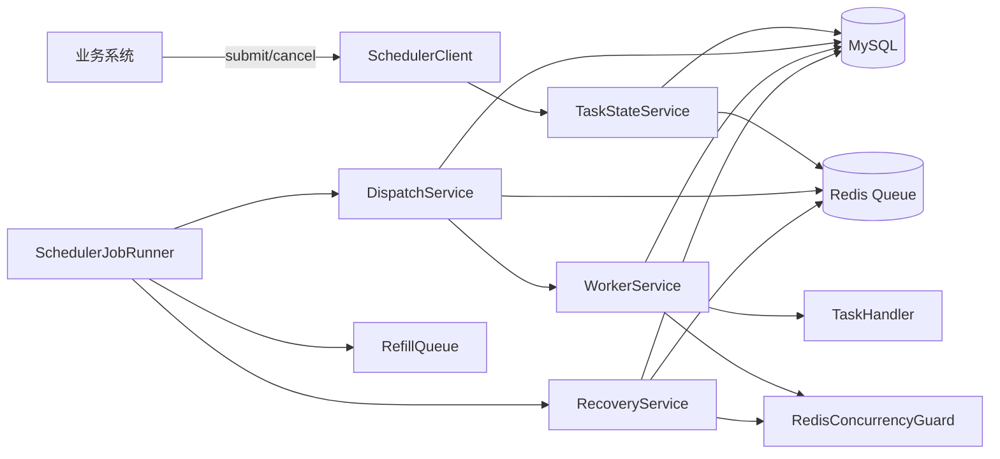
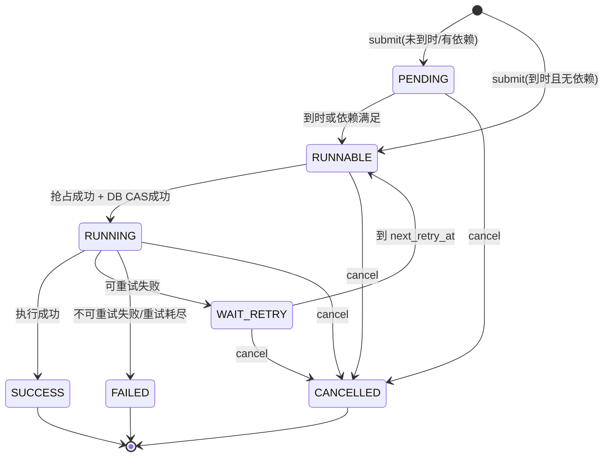
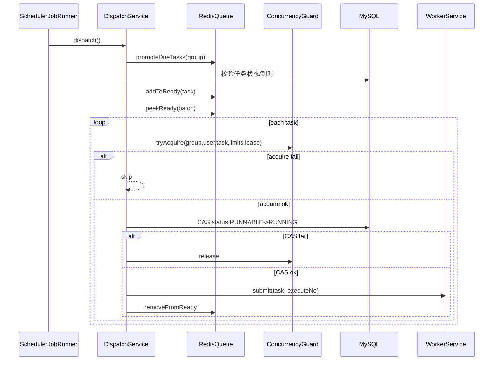
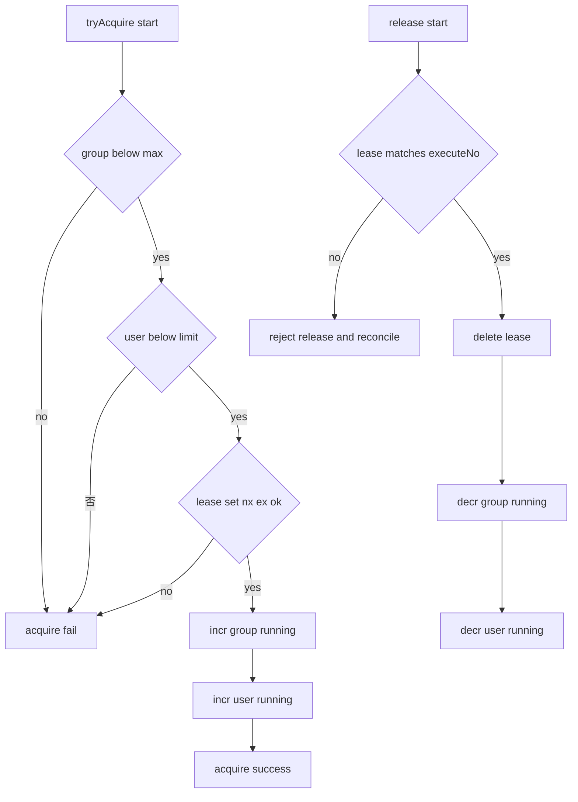
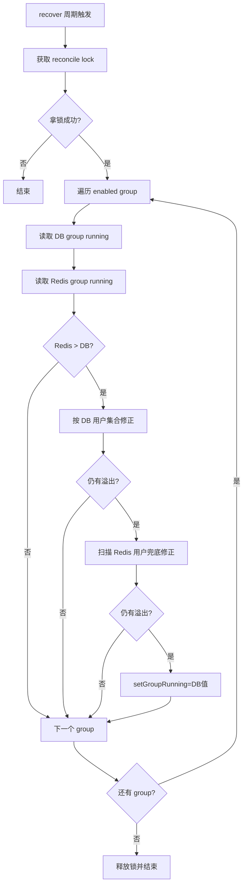

# 技术方案设计

## 1. 目标与范围

本文档描述 `user-task-scheduler` 的实现方案，重点覆盖：

- 表设计
- 任务状态机
- 调度流程
- 并发控制
- 动态并发策略
- 对账策略

## 2. 设计原则

- DB 是最终真相：任务状态、执行记录以 MySQL 为准
- Redis 是协作层：队列、并发计数、租约
- 至少一次语义：业务侧必须保证幂等
- 无外部调度平台依赖：仅需 MySQL + Redis

## 3. 总体架构图



## 4. 表设计

表定义见：[schema-mysql.sql](/Users/chenmingdong01/Documents/github/user-task-scheduler/scheduler-starter/src/main/resources/sql/schema-mysql.sql)

### 4.1 `scheduler_task`（任务主表）

关键字段：

- `task_no`：调度内部唯一号（唯一索引）
- `group_code`：任务组
- `user_id`：用户维度并发键
- `biz_type`：业务类型（映射 `TaskHandler`）
- `biz_key`：业务键（可重复，业务侧幂等控制）
- `status`：`PENDING/RUNNABLE/RUNNING/WAIT_RETRY/SUCCESS/FAILED/CANCELLED`
- `priority`：优先级（值越大越高）
- `execute_at`：计划执行时间
- `retry_count/max_retry_count`：重试计数
- `retry_delay_sec`：单任务重试间隔
- `heartbeat_time`：DB 心跳时间（恢复判断基准）
- `dispatcher_instance/worker_instance/worker_thread`：执行归属
- `ext_info`：跨重试透传数据
- `version`：乐观锁版本号

关键索引：

- `idx_group_status_time(group_code, status, execute_at)`
- `idx_status_time(status, execute_at)`
- `idx_user_group_status(user_id, group_code, status)`
- `idx_heartbeat(status, heartbeat_time)`

### 4.2 `scheduler_task_dependency`（依赖关系）

关键字段：

- `task_id`
- `depends_on_task_id`
- `target_state`：`SUCCESS/FAILED/TERMINAL`
- `status`：`WAITING/SATISFIED/IMPOSSIBLE`

约束：

- `uk_task_dependency(task_id, depends_on_task_id)` 防重复依赖

### 4.3 `scheduler_group_config`（组配置）

关键字段：

- `group_code`：唯一组编码
- `enabled`：组开关
- `max_concurrency`：group 全局最大并发
- `user_base_concurrency`：单用户基础并发
- `dynamic_user_limit_enabled`：动态并发开关
- `load_strategy_json`：动态并发策略
- `dispatch_batch_size`：每轮扫描批次
- `heartbeat_timeout_sec`：心跳超时阈值
- `lock_expire_sec`：lease TTL

### 4.4 `scheduler_task_execution`（执行记录）

关键字段：

- `execute_no`：一次执行实例号（唯一）
- `task_id/task_no/group_code/user_id`
- `status`：`RUNNING/SUCCESS/FAILED/WAIT_RETRY`
- `start_time/finish_time/duration_ms`
- `error_code/error_msg`

## 5. 任务状态机



迁移约束：

- `RUNNABLE -> RUNNING` 必须先成功抢占并发，再 CAS 更新 DB
- 终态迁移统一经 `TaskStateService`，同步触发依赖下游刷新
- Redis 队列命中不代表可执行，最终以 DB 状态校验为准

## 6. 调度流程

入口：`SchedulerJobRunner` 三个定时任务：

- `dispatch()`：默认每 500ms
- `recover()`：默认每 30s
- `refillQueue()`：默认每 15s

### 6.1 提交流程

入口：`DefaultSchedulerClient.submit` + `TaskStateService.submit`

1. 参数归一化（默认 group、executeAt、maxRetryCount、priority）
2. 事务落库 `scheduler_task` 与依赖关系
3. 计算初始状态：
- 无依赖且到时 -> `RUNNABLE`
- 否则 -> `PENDING`
4. 入 Redis time/ready 队列

### 6.2 两阶段调度时序图



ready 队列排序：

- `score = (MAX_PRIORITY - priority) * 10^13 + createTimeEpochMillis`
- 保证高优先级优先，同优先级先提交先执行

### 6.3 执行流程

入口：`WorkerService.run`

1. 写执行开始记录
2. 启动心跳任务（DB heartbeat + lease renew）
3. 业务状态短路（可选）
4. 执行 `TaskHandler.execute`（含超时控制）
5. 根据结果写回 `SUCCESS/FAILED/WAIT_RETRY`
6. finally：释放 lease 与并发计数，写执行结束记录

## 7. 并发控制

核心组件：`RedisConcurrencyGuard`

### 7.1 三类 Redis Key

- `sched:group:running:{group}`：group 运行计数
- `sched:user:running:{group}:{userId}`：用户运行计数
- `sched:task:lease:{taskId}`：任务租约（value=`executeNo`）

### 7.2 抢占与释放流程图



## 8. 动态并发策略

组件：`DynamicUserLimitService`

输入：

- `groupRunning`
- `groupMaxConcurrency`
- `userBaseConcurrency`
- `load_strategy_json`

计算：

- `load = groupRunning / groupMaxConcurrency`
- 按规则命中 `factor`
- `effectiveUserLimit = clamp(round(userBase * factor), minLimit, maxLimit)`

示例策略：

```json
{
  "enabled": true,
  "rounding": "FLOOR",
  "minLimit": 1,
  "maxLimit": 20,
  "rules": [
    {"loadLt": 0.25, "factor": 4.0},
    {"loadLt": 0.50, "factor": 2.0},
    {"loadLt": 0.75, "factor": 1.0},
    {"loadLt": 1.01, "factor": 0.5}
  ]
}
```

效果：

- 低负载放宽单用户并发
- 高负载自动收敛单用户并发，保护整体公平性

## 9. 对账策略

组件：`RecoveryService`

### 9.1 定期对账

入口：`reconcileRunningCountersIfNeeded`

- 先抢分布式对账锁
- 遍历 group，对比 DB `RUNNING` 与 Redis 计数
- 重点处理 `redis > db`（计数泄漏）
- 两段修复：
- 先按 DB 用户集合修正
- 再扫描 Redis 用户兜底修正
- 最终必要时强制 `setGroupRunning(db值)`

### 9.2 即时对账

入口：`reconcileRunningCountersImmediately`

触发场景：

- release mismatch
- dispatch 回滚时 release mismatch
- worker finally release mismatch

策略：

- group 维度节流（throttle key）
- 获取全局对账锁后，按 group+user 快速对齐
- 优先修 user 计数，再修 group 计数

### 9.3 对账流程图



## 10. 一致性与容错

- 一致性核心：`Redis 抢占` + `DB CAS` + `Recovery Refill`
- Redis 丢失可由 DB refill 重建
- 宕机后通过 `heartbeat timeout + lease 检查` 回收任务
- `TASK_TIMEOUT_UNINTERRUPTIBLE` 场景可能出现旧执行未停且新重试已启动，业务必须幂等

## 11. 代码定位

- [DispatchService.java](/Users/chenmingdong01/Documents/github/user-task-scheduler/scheduler-starter/src/main/java/org/dong/scheduler/core/service/DispatchService.java)
- [WorkerService.java](/Users/chenmingdong01/Documents/github/user-task-scheduler/scheduler-starter/src/main/java/org/dong/scheduler/core/service/WorkerService.java)
- [RecoveryService.java](/Users/chenmingdong01/Documents/github/user-task-scheduler/scheduler-starter/src/main/java/org/dong/scheduler/core/service/RecoveryService.java)
- [TaskStateService.java](/Users/chenmingdong01/Documents/github/user-task-scheduler/scheduler-starter/src/main/java/org/dong/scheduler/core/service/TaskStateService.java)
- [RedisConcurrencyGuard.java](/Users/chenmingdong01/Documents/github/user-task-scheduler/scheduler-starter/src/main/java/org/dong/scheduler/core/redis/RedisConcurrencyGuard.java)
- [schema-mysql.sql](/Users/chenmingdong01/Documents/github/user-task-scheduler/scheduler-starter/src/main/resources/sql/schema-mysql.sql)
